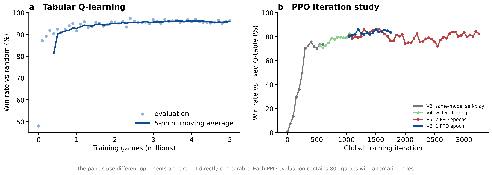
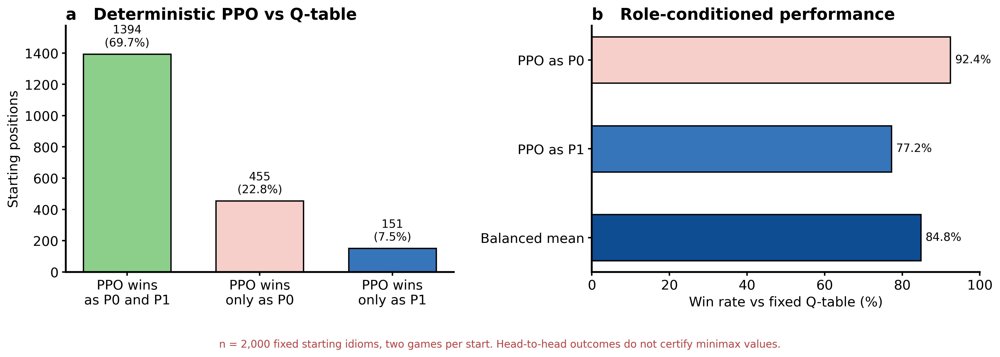

# Idiom Game Solver

> 将四字成语接龙建模为带历史约束的有向图零和博弈，并研究精确搜索、表格型强化学习与神经网络自博弈方法。

本仓库关注一个简单但计算上困难的问题：当双方掌握同一成语库、同局成语不能重复时，如何选择下一条接龙，使对手最终无路可走？项目包含小图上的精确求解器、大图上的 Q-Learning 基线，以及使用字符编码与历史 Cross-Attention 的 PPO 策略网络。


## 项目概览

| 项目 | 当前实现 |
|---|---:|
| 原始四字成语 | 29,502 |
| 迭代移除死端后 | 26,108 |
| 剪枝后有向边 | 630,847 |
| 平均出度 | 24.16 |
| 神经网络参数量 | 3,996,866 |
| PPO 历史窗口 | 最近 64 个成语 |
| 动作空间上限 | 600（当前图最大出度 533） |

当前 RL 环境采用严格的“尾字等于首字”规则。`IdiomDictionary` 还包含同音索引接口，但大规模 PPO 数据管线尚未启用同音接龙，因此本文档不会把两种规则下的统计量混为一谈。

## 问题定义

将成语库表示为有向图 $G=(V,E)$。如果成语 $u$ 的尾字等于成语 $v$ 的首字，则存在边 $u\rightarrow v$。

游戏状态为：

$$
s_t=(u_t,U_t),
$$

其中 $u_t$ 是当前成语，$U_t$ 是本局已经使用的成语集合。合法动作集合为：

$$
A(s_t)=\{v\mid(u_t,v)\in E,\ v\notin U_t\}.
$$

若 $A(s_t)=\varnothing$，当前行动方失败。由于需要记录 $U_t$，直接动态规划的状态规模为 $O(|V|2^{|V|})$；在 $|V|=26{,}108$ 时无法进行全图精确求解。

## 方法

### 精确与传统方法

- `SGSolver`：使用 Sprague–Grundy 递归与状态缓存，在小图上计算胜负态。
- `MinimaxSolver`：Minimax、Alpha–Beta 剪枝和迭代加深。
- `ValueIterationSolver`：忽略完整历史后的节点价值近似。
- `MCTSPlayer`：用于局部搜索与方法对比的蒙特卡洛树搜索基线。

这些方法适合验证小规模局面，但不能直接精确求解 26K 节点的完整带历史博弈。

### 表格型 Q-Learning

Q-table 使用当前节点和下一动作 $(u,v)$ 作为近似状态—动作表示，不显式编码完整的 $U_t$。这降低了状态复杂度，但也使问题从完整可观测 MDP 变成近似的部分可观测决策过程。

Go 实现支持多核并行自博弈；仓库保留了训练结果和可加载的 `qtable.pkl` 基准。

### PPO 策略—价值网络


下图与 `src/rl/model.py`、`src/rl/config.py` 和 `src/rl/rollout.py` 逐项核对。当前实现不是通用 Transformer encoder，而是以当前成语为单 Query 的 Cross-Attention 网络：

| 模块 | 实际实现 |
|---|---|
| 共享字符编码器 | 4 个字符分别查 64 维 embedding，拼接为 256 维，再经 `Linear(256, 384)` 与 `LayerNorm(384)` |
| Query | 当前成语向量 + 当前角色 embedding + 当前玩家 embedding |
| Key/Value | 可学习 EMPTY token + 最近 64 个先前成语向量；历史向量加入历史角色 embedding |
| 历史编码器 | 3 个顺序堆叠的 Cross-Attention 模块；每个模块含 4 头注意力、两次残差与 LayerNorm，以及 `384→768→384` 的 GELU FFN |
| 策略头 | 状态向量与候选成语向量点积，除以可学习温度；非法候选 logits 掩码为 $-\infty$ |
| 价值头 | `Linear(384,192) → GELU → Linear(192,1) → Tanh` |
| 参数量 | 字符表 4,215（含 PAD）时，共 3,996,866 个可训练参数 |

候选动作只经过共享字符编码器，不进入 Cross-Attention，也不叠加角色或玩家 embedding。实现中没有位置 embedding，因此最近 64 步被作为带掩码的历史集合编码，而非显式的有序序列。

同一网络随机采样并控制 P0/P1 双方；纯自博弈每局分别记录两个玩家视角的轨迹，再使用 PPO 更新共享参数。

### 近似状态与证据边界


网络只观察最近 64 个先前成语，但环境始终使用完整的已用集合过滤重复动作。因此，历史截断造成的是信息损失，不会放宽合法动作约束。对局在 200 个环境步达到上限时按中性回报截断；当前 GAE 实现没有在截断点进行价值 bootstrap。

## 实验结果应该如何解读

仓库中的代表性结果包括：

| 方法 | 对手 | 观测结果 | 证据范围 |
|---|---|---:|---|
| Go Q-Learning | Random | 约 96%–97% | 不同训练产物与结果文件的数值略有差异 |
| Q-table checkpoint | Random | 99.85% | checkpoint 元数据与训练日志 |
| PPO V6 | 固定 Q-table | 约 84%–86% | 每次评估 800 局，先后手交替 |
| PPO V6 | Random | 约 99.9%–100% | 训练日志 |



这些数字来自不同对手，不能横向当作同一排行榜。尤其需要强调：

> PPO 对固定 Q-table 的约 85% 胜率是经验基准结果，不是全图 minimax 最优性的证明，也不是经过认证的“游戏理论上限”。

对 2,000 个固定起始成语的确定性对局中，PPO 作为 P0 的胜率为 92.4%，作为 P1 的胜率为 77.2%，平衡平均约 84.8%。该结果说明性能与起点、角色高度相关；Q-table 自对弈只能提供交叉检查，不能给出局面的真实博弈论值。更严格的结论需要精确可解子图、可证明界或 exploitability 分析。



## 快速开始

### 基础算法与单元测试

基础求解器只依赖 Python 标准库：

```bash
python -m unittest tests.test_solver -v
python main.py
```

### 强化学习环境

安装 PyTorch、NumPy、TensorBoard 和 Matplotlib：

```bash
python -m pip install -r requirements.txt
```

运行 RL 模块自检：

```bash
python src/rl/train_rl.py --quick
```

纯同模型自博弈配置：

```bash
python src/rl/train_rl.py \
  --stage1-max-iters 0 \
  --stage2-max-iters 0 \
  --stage3-self-ratio 1.0 \
  --stage3-random-ratio 0.0 \
  --stage3-qtable-ratio 0.0 \
  --no-frozen
```

交互式对局：

```bash
python play.py
```

训练和交互运行需要与本机设备匹配的 PyTorch。训练配置和交互脚本会在 CUDA、Apple MPS 与 CPU 之间自动选择；仓库中的最终 checkpoint 主要在 CUDA 环境训练，其他设备仍需回归验证。

## 仓库结构

```text
idiom-game-solver/
├── data/                  # 成语数据与新华词典来源
├── src/
│   ├── idiom_data.py      # 数据加载、首尾字索引
│   ├── idiom_graph.py     # 有向图与游戏状态
│   ├── sg_solver.py       # Sprague–Grundy 求解器
│   ├── minimax_solver.py  # Minimax / Alpha–Beta
│   ├── selfplay_solver.py # 表格型自博弈
│   ├── methods/           # VI、Q-Learning、MCTS 对比玩家
│   └── rl/                # PPO 环境、模型、rollout、训练与评估
├── go/                    # 高性能 Q-Learning 实现
├── tests/                 # 基础算法测试
├── checkpoints/           # 最终 PPO checkpoint 与 Q-table
├── logs/                  # 训练版本日志
├── results/               # 实验结果与训练曲线
├── figures/               # README 与论文图
└── docs/                  # 技术说明、实验记录与论文草稿
```

## 可复现绘图

量化图只从仓库中的 JSON 结果和训练日志生成：

```bash
python scripts/generate_paper_figures.py
```

脚本同时输出适合 README 的 PNG 和适合论文排版的 PDF。概念图用于解释方法，不参与数值证据。

## 已知局限

- 全图没有精确 minimax 解；当前结论是经验性的相对基准结论。
- PPO 主要与单个确定性 Q-table 评估，仍需增加多随机种子、MCTS、历史 checkpoint 和独立测试起点。
- 训练仅保留最近 64 步历史；专门延长对局的对手可能造成分布偏移。
- 强策略自博弈平均对局较短，模型对超长残局的覆盖有限。
- 当前大规模 RL 图只实现同字接龙，不包含同音接龙。
- 最终 checkpoint 主要在 CUDA 环境验证，CPU/MPS 推理路径虽已适配但缺少完整回归测试。
- 现有基础单元测试覆盖经典求解器；RL 端缺少完整的 checkpoint 回归测试。

## 文档索引

- [`docs/project_description.md`](docs/project_description.md)：项目与传统求解器说明
- [`docs/selfplay_experiments.md`](docs/selfplay_experiments.md)：PPO V1–V7 实验记录
- [`docs/85percent_limit.md`](docs/85percent_limit.md)：85% 平台期的重新审视
- [`docs/paper_polished.md`](docs/paper_polished.md)：论文长稿
- [`idiom_rl_plan.md`](idiom_rl_plan.md)：RL 设计计划与早期假设

## 数据来源与许可

成语数据来自仓库中包含的 `chinese-xinhua` 数据集副本，其许可证见 [`data/chinese-xinhua-master/LICENSE`](data/chinese-xinhua-master/LICENSE)。使用或发布模型与衍生数据前，请同时检查原始数据许可和本仓库许可状态。

## 下一步

当前最有价值的研究方向不是简单扩大网络，而是建立更可信的评估：

1. 在精确可解的小型连通子图上测量策略准确率与 regret；
2. 使用多个训练随机种子和独立测试起点报告置信区间；
3. 加入神经网络引导的 MCTS，并与纯策略网络做计算量匹配对比；
4. 报告不同角色、不同起点类别和不同对手下的分层结果；
5. 将同音接龙作为独立规则集重新构图和训练，而不是混用统计口径。
