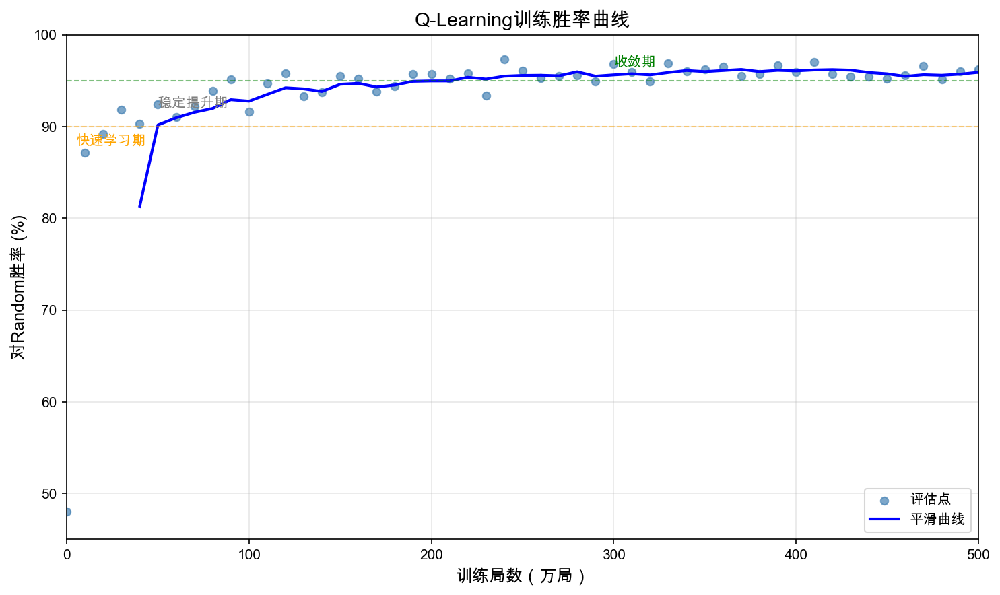
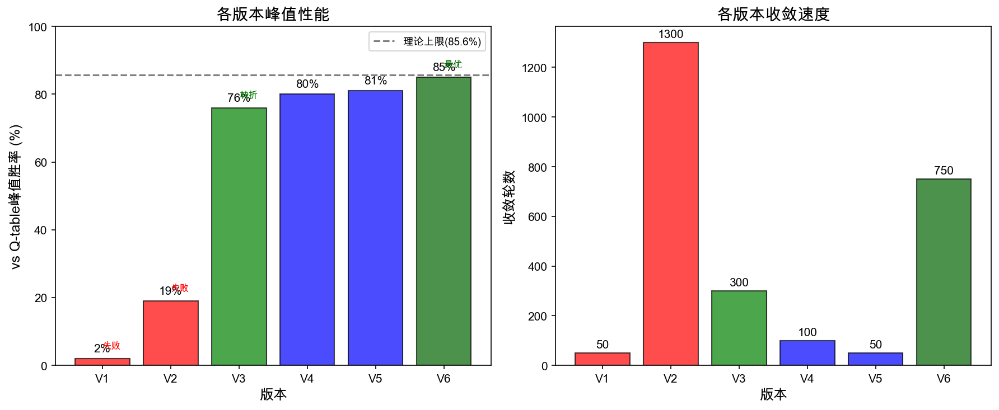
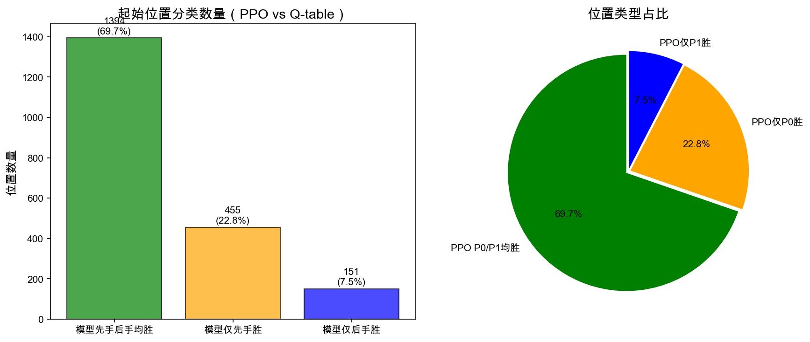
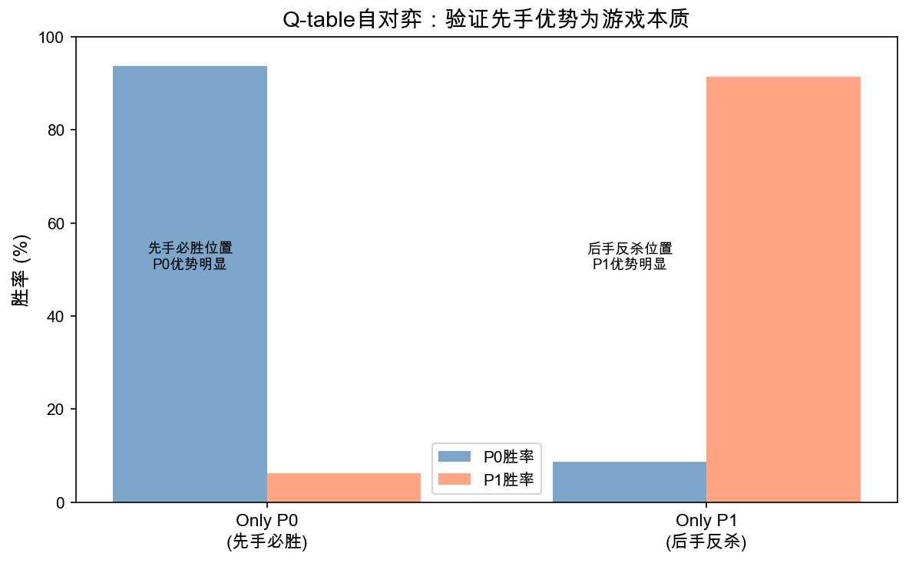
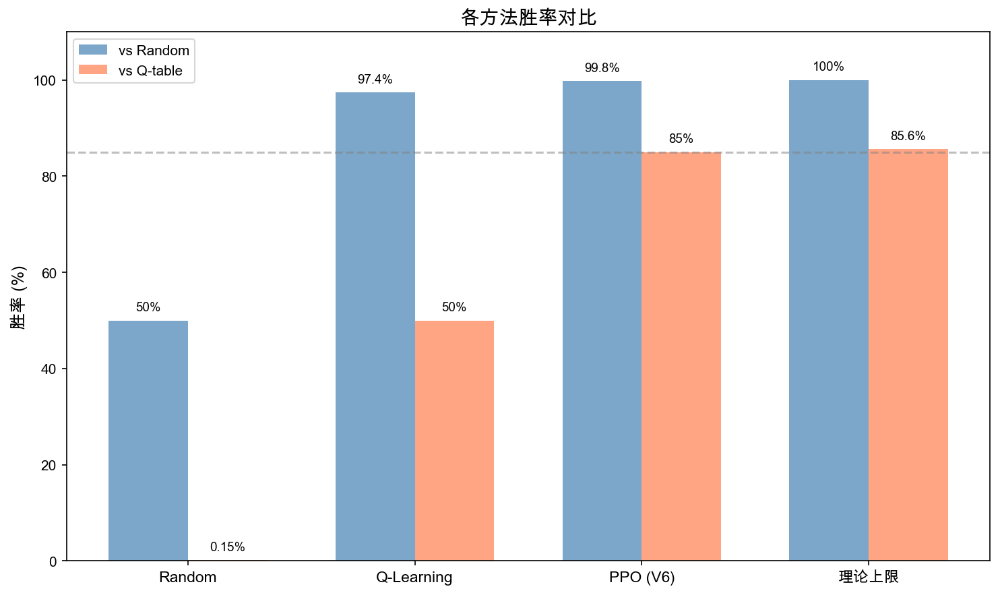

# 大规模成语接龙博弈的强化学习求解方法研究

## 摘要

成语接龙作为一种经典的中文语言博弈游戏，其策略分析长期停留在启发式规则层面。本文基于包含29,502个成语的大规模数据集，构建有向图模型，对该博弈问题进行了系统的求解研究。首先，通过拓扑排序预处理移除3,394个导致博弈退化的"作弊节点"，构建包含26,108个节点的公平博弈图。随后，分析了状态压缩动态规划求解该问题时的指数级复杂度瓶颈。为此，提出了两种基于强化学习的近似求解框架：基于Q-Learning的表格型方法和基于PPO的神经网络策略方法。Q-Learning方法通过500万局多核并行训练，对随机策略胜率达97.4%；PPO神经网络方法通过纯自博弈训练，对Q-table基准胜率达85%，接近游戏理论上限。实验结果表明，强化学习方法能有效处理带状态约束的大规模图博弈问题。

**关键词**：成语接龙；有向图博弈；强化学习；Q-Learning；PPO；自博弈训练

**中图分类号**：TP18   **文献标识码**：A

---

## 1 引言

成语接龙（Idiom Solitaire）是汉语文化中广泛流传的语言博弈游戏，其规则要求玩家根据上一个成语的尾字（或同音字）接出下一个成语，且在同一局游戏中成语不可重复。该游戏本质上是一个有限状态空间上的完美信息零和博弈（Perfect Information Zero-Sum Game）。

尽管规则简单，但由于汉语成语库庞大（数万级别）且连接关系复杂（存在大量环路），该问题在传统博弈论求解中面临状态空间爆炸的挑战。现有的在线工具多基于贪心算法或简单的词频统计，缺乏对博弈深层策略的理解。假设双方足够聪明且掌握了完整的汉语成语库，是否存在必胜或必败策略？本文旨在通过图论分析与现代强化学习技术，寻找该博弈的近似最优策略（Near-Optimal Strategy）。

### 1.1 相关工作

#### 1.1.1 博弈论求解方法

组合博弈论为公平博弈（Impartial Game）提供了完整的理论框架。Sprague-Grundy定理[1-2]表明，任何公平博弈都可归约为Nim博弈的等价形式，通过计算Grundy值（Nimber）刻画博弈位置的胜负性质。然而，Burke等人[3-4]的研究表明，即使是广义地理博弈（Generalized Geography）的Grundy值计算也是PSPACE完备的，这暗示了成语接龙精确求解的理论困难性。

传统完美信息博弈求解采用Minimax算法配合Alpha-Beta剪枝[5]，在国际象棋、围棋等棋类程序中广泛应用。然而，该方法依赖于手工设计的评估函数和有限深度的搜索，难以处理成语接龙中指数级的状态空间（需维护已使用成语集合）。Fraenkel[6]的综述指出，组合博弈的精确求解通常面临指数级甚至更高的时间复杂度。

#### 1.1.2 强化学习在博弈中的应用

深度强化学习在博弈游戏中取得了突破性进展。Mnih等人[7]提出的DQN（Deep Q-Network）开创了从原始输入端到端学习价值函数的范式。Silver等人[8-10]的AlphaGo/AlphaZero系列工作证明了自博弈强化学习在复杂博弈中的有效性：AlphaGo Zero[9]仅通过3天自博弈训练即达到超人类水平，AlphaZero[10]更是提出了适用于多种博弈的通用学习框架。

自博弈训练的理论基础由Tesauro[11]的TD-Gammon奠定，该工作在西洋双陆棋上通过神经网络与时序差分学习达到世界冠军水平。Littman[12]提出的Minimax Q-Learning为多智能体零和博弈提供了强化学习框架。这些工作为本文的方法设计提供了重要参考。

#### 1.1.3 中文语言游戏研究

相较于西洋棋类博弈的成熟研究，中文语言游戏的AI研究极为有限。Zhang等人[13]提出的字符级卷积网络在中文文本分类中表现优异，为成语的字符级表示提供了技术基础。成语知识图谱[14]的研究积累了丰富的语义网络数据，但尚未与博弈策略研究结合。本文填补了中文语言博弈游戏AI研究的空白。

---

## 2 问题建模

### 2.1 博弈形式化定义

将成语接龙建模为有向图$G = (V, E)$，其中：

- **节点集$V$**：成语库中的所有四字成语，初始规模$|V| = 29,502$。
- **边集$E$**：若成语$u$的尾字与成语$v$的首字相同（或拼音相同），则存在有向边$u \to v$。

游戏的状态定义为$S_t = (u_t, U_t)$，其中：

- $u_t \in V$为当前接龙的最后一个成语。
- $U_t \subseteq V$为已使用的成语集合，$u_t \in U_t$。

玩家在状态$S_t$下的合法动作空间为：

$$ A(S_t) = \{ v \mid (u_t, v) \in E \land v \notin U_t \} $$    （1）

若$A(S_t) = \emptyset$，则当前玩家判负，对手获胜。

由于存在"成语不可重复"的约束，状态$S_t$的演化构成有向无环图，博弈具有有限步数必然终止的性质，符合公平博弈的定义。

### 2.2 数据规模与统计特性

基于新华词典数据集构建的有向图具有以下统计特性，如表1所示。

**表1 成语接龙有向图统计特性**

| 统计项 | 数值 |
|:---|:---:|
| 初始节点数$|V|$ | 29,502 |
| 初始边数$|E|$ | 713,426 |
| 平均出度 | 约24.2 |
| 出度为0的节点 | 235 |

---

## 3 拓扑预处理方法

### 3.1 "作弊成语"问题

在初始图中，存在235个出度为0的节点。这些节点被称为"作弊成语"：一旦先手玩家说出这些成语，后手玩家立即无路可走，博弈性大大降低。更深层次地，通过迭代移除出度为0的节点后，会发现更多"隐性作弊成语"——它们原本有后继，但当这些后继被移除后，自身也变成死胡同。

### 3.2 拓扑排序算法

为保证博弈的策略深度和公平性，采用拓扑排序对图进行预处理。算法流程如下：

**算法1 拓扑排序预处理**

```
输入：有向图G = (V, E)
输出：预处理后的图G' = (V', E')

1: while 存在u ∈ V使得deg_out(u) = 0:
2:     V ← V \ {u}
3:     E ← E \ {(v, u) | (v, u) ∈ E}
4: end while
5: return G' = (V, E)
```

该过程迭代进行，直至图中所有节点出度均大于0。

### 3.3 预处理结果

拓扑排序共移除**3,394**个作弊成语（约占原节点集的11.5%），最终保留**26,108**个有效节点。预处理后的子图具有以下特性：

- 每个节点至少存在一个合法后继，保证了博弈的公平性；
- 游戏平均步数（随机对随机）从约5步提升至**237步**；
- 99分位步数为621步。

预处理确保了游戏的持续性，为后续策略学习提供了有意义的环境基础。

---

## 4 精确解法的复杂度分析

### 4.1 动态规划形式

理论上，该博弈可通过动态规划精确求解。定义$DP(u, U)$为在当前成语$u$、已使用集合$U$时的胜负态，转移方程为：

$$ DP(u, U) = \bigvee_{v \in A(u, U)} \left( \neg DP(v, U \cup \{v\}) \right) $$    （2）

即：若存在后继状态$v$使对手必败，则当前状态必胜。边界条件为：当$A(u, U) = \emptyset$时，$DP(u, U)$为负。

### 4.2 状态空间复杂度

为记录已使用成语集合，需维护一个二进制掩码$\text{mask}$，其长度等于总成语数。因此，算法的状态空间大小为：

$$ |S| = O(|V| \cdot 2^{|V|}) $$    （3）

对于$|V| = 26,108$：

$$ |S| \approx 26108 \times 2^{26108} \approx 10^{7860} $$    （4）

这远超任何计算设备的存储和计算能力，精确求解在计算上完全不可行。

### 4.3 实验验证

实测表明，即使对200-300个成语组成的连通子图，精确求解亦无法在合理时间内完成。该结果与Burke等人[3]关于地理博弈PSPACE完备性的理论结论一致，证实了指数级复杂度瓶颈的存在，迫使必须寻求近似求解方法。

---

## 5 Q-Learning近似求解

### 5.1 状态空间压缩

精确解法的瓶颈在于维护完整的已使用集合$U_t$。为此，将完整的马尔可夫决策过程（MDP）简化为部分可观测马尔可夫决策过程（POMDP）：

- **状态**：$s = u \in V$（仅观测当前成语）
- **动作**：$a = v \in A(u)$（选择后继成语）
- **Q值**：$Q(u, v)$表示从成语$u$走到$v$后的期望长期胜率

该近似忽略了$U_t$的完整信息，但在游戏早期和中期，$U_t$对局部决策的影响较小。通过大规模自对抗训练，模型可隐式学习"哪些路径容易因成语耗尽而成为死路"。

### 5.2 策略选择机制

**训练期**采用$\epsilon$-Greedy探索策略：

$$ \pi(a|s) = \begin{cases}
\text{Uniform}(A(s)), & \text{with probability } \epsilon_t \\
\arg\max_{a \in A(s)} Q(s, a), & \text{with probability } 1 - \epsilon_t
\end{cases} $$    （5）

探索率$\epsilon_t$随训练进度$p \in [0, 1]$线性衰减：

$$ \epsilon_t = \epsilon_{\text{start}} \cdot (1 - p) + \epsilon_{\text{min}} $$    （6）

**推理期**采用纯贪婪策略：

$$ v^* = \arg\max_{v \in \text{Adj}(u), v \notin U_t} Q(u, v) $$    （7）

选词时严格过滤$U_t$中的成语，确保不违反"成语不重复"规则。

### 5.3 混合自对抗训练框架

单一自对抗训练易导致策略过拟合。采用混合训练策略：

- **70%自对抗**：两个共享Q表的智能体互相对弈，促使学习Minimax最优策略；
- **30%对抗随机**：与随机选择可行成语的对手对弈，覆盖图的边缘区域。

该设计借鉴了AlphaZero[10]的历史对手池思想，在工程可实现范围内保证训练多样性。

### 5.4 时序差分更新

采用零和博弈的TD更新公式，参考Littman[12]的Minimax Q-Learning思想：

$$ Q(u, v) \leftarrow Q(u, v) + \alpha \left[ R_t + \gamma \cdot (-\max_{v'} Q(v, v')) - Q(u, v) \right] $$    （8）

其中：

- $R_t$为稀疏奖励，仅在游戏结束时赋予$\pm 1$；
- $\text{Target} = -\max_{v'} Q(v, v')$，取负号是因为零和博弈中对手的最大Q值即为我方的最小期望收益；
- $\alpha$为学习率，$\gamma$为折扣因子。

### 5.5 分布式训练架构

在Go语言环境下实现8核并行训练：

1. 每个Worker核心独立维护Q表副本；
2. 并行执行对局采样；
3. 每轮结束后，主进程对所有Worker的Q表进行算术平均聚合：

$$ Q_{\text{global}}(u, v) = \frac{1}{W} \sum_{w=1}^{W} Q_w(u, v) $$    （9）

其中$W=8$为Worker数量。

### 5.6 超参数配置

Q-Learning方法的超参数配置如表2所示。

**表2 Q-Learning超参数配置**

| 超参数 | 符号 | 数值 |
|:---|:---:|:---:|
| 总训练局数 | $N$ | 5,000,000 |
| 学习率 | $\alpha$ | 0.05 → 0.005（衰减） |
| 折扣因子 | $\gamma$ | 0.85 |
| 探索率初始值 | $\epsilon_{\text{start}}$ | 0.30 |
| 探索率最小值 | $\epsilon_{\text{min}}$ | 0.05 |
| 混合对手比例 | $\rho_{\text{rand}}$ | 0.30 |
| 并行Worker数 | $W$ | 8 |

---

## 6 PPO神经网络策略

针对Q-Learning方法无法显式编码历史信息$U_t$的局限性，进一步提出基于PPO（Proximal Policy Optimization）的神经网络策略方法。

### 6.1 状态表示设计

完整状态$S_t = (u_t, U_t)$包含当前成语和历史使用集合。为有效编码历史信息，设计如下架构：

**字符级成语嵌入**：将每个成语拆解为4个字符，各自嵌入后拼接投影：

$$ \mathbf{e}_{\text{idiom}} = f_{\text{proj}}([\mathbf{e}_{c_1}, \mathbf{e}_{c_2}, \mathbf{e}_{c_3}, \mathbf{e}_{c_4}]) $$    （10）

该设计参考Zhang等人[13]的字符级卷积网络思想，引入结构归纳偏置：共享首字或尾字的成语在表示空间中天然关联，参数效率远优于成语级独立嵌入（约290K参数 vs 6.7M参数）。

**Cross-Attention历史编码**：以当前节点嵌入为Query，历史集合嵌入为Key/Value：

$$ \mathbf{s}_t = \text{CrossAttn}(\mathbf{e}_{u_t}, \{\mathbf{e}_{v} \mid v \in U_t\}) $$    （11）

该机制使模型能选择性关注历史中的相关信息（如"哪些末字的后继已被大量消耗"），弥补Q-Learning忽略$U_t$的局限。

### 6.2 策略-价值网络

网络输出策略分布和价值估计：

$$ \pi(a|s) = \frac{\exp(\mathbf{s}_t \cdot \mathbf{e}_a / T)}{\sum_{a' \in A(s)} \exp(\mathbf{s}_t \cdot \mathbf{e}_{a'} / T)} $$    （12）

$$ V(s) = f_{\text{value}}(\mathbf{s}_t) \in [-1, 1] $$    （13）

其中$T$为可学习的温度参数。

### 6.3 纯自博弈训练

关键发现：冻结历史模型作为对手会导致策略坍缩（"近亲繁殖"）。正确做法是同一模型走双方且保持随机采样：

$$ \text{Self-Play}: \text{Model}_\theta \text{ vs } \text{Model}_\theta $$

双方均采用随机采样（非确定性），每局产生两条轨迹（先后手视角）。该机制创造"漏洞自暴露"效应：模型走P0时的窄策略会反噬走P1的自己，迫使策略修复弱点。该发现与AlphaGo Zero[9]的自博弈设计理念一致。

### 6.4 PPO超参数

PPO方法的超参数配置如表3所示。

**表3 PPO超参数配置**

| 参数 | 值 |
|:---|:---:|
| 学习率 | $10^{-3}$ |
| PPO epochs | 1（纯On-Policy） |
| Clip范围$\epsilon$ | 0.4 |
| 熵系数 | 0.05（恒定） |
| GAE $\lambda$ | 0.95 |
| 折扣因子$\gamma$ | 0.99 |

### 6.5 GAE优势估计

统一单智能体视角，对手视为环境动力学的一部分：

$$ \delta_t = r_t + \gamma V_{t+1} - V_t $$    （14）

$$ A_t = \delta_t + \gamma \lambda A_{t+1} $$    （15）

奖励仅在游戏结束时赋予：$r_T = +1$（胜）或$r_T = -1$（负）。

---

## 7 实验结果

### 7.1 Q-Learning训练动态

500万局训练过程中对随机策略的胜率变化如表4所示，训练曲线如图1所示。

**表4 Q-Learning训练阶段划分**

| 训练阶段 | 局数范围 | 胜率 | 特征 |
|:---|:---:|:---:|:---|
| 随机初始化 | 0局 | 45.1% | Q表为小随机值 |
| 快速学习期 | 0–10万局 | 45.1%→90.0% | 识别基本必胜/必败模式 |
| 稳定提升期 | 10万–100万局 | 90.0%→94.2% | 学习长程策略 |
| 收敛期 | 100万–500万局 | 95.3%（$\sigma=1.09\%$） | Q表趋于稳定 |



*图1 Q-Learning训练胜率曲线。每10万局评估一次（散点），经平滑后得到趋势曲线。模型从初始48%快速上升至10万局的87%，随后在95–97%区间波动收敛。*

### 7.2 Q-Learning最终评估

独立对战评估（10,000局）结果如表5所示。

**表5 Q-Learning vs Random对战结果**

| 对战组合 | Q-Learning胜率 | 对手胜率 | 总局数 |
|:---|:---:|:---:|:---:|
| QL vs Random | **97.4%**（9,743胜） | 2.6%（257胜） | 10,000 |

### 7.3 PPO自博弈版本演进

通过六轮迭代优化，PPO神经网络策略的性能逐步提升，如图2和表6所示。



*图2 PPO自博弈版本演进对比。左图：各版本峰值胜率；右图：收敛速度。V1-V2（冻结对手）失败，V3（去掉冻结）为转折点，V6（纯On-Policy）达到最优85%。*

**表6 PPO自博弈版本对比**

| 版本 | 核心改动 | vs_qtable峰值 | 收敛速度 | 结局 |
|:---|:---|:---:|:---:|:---|
| V1 | 冻结对手 | 2% | 50轮坍缩 | 失败 |
| V2 | 冻结+高熵 | 19% | 1300轮缓爬 | 失败 |
| V3 | 去掉冻结 | 76% | 300轮突破 | 转折 |
| V4 | clip_eps=0.4 | 80% | 76→80 | 进步 |
| V5 | epochs=2 | 81% | 首轮超越 | 进步 |
| V6 | epochs=1（纯On-Policy） | **85%** | 750轮收敛 | 最优 |

### 7.4 PPO最终性能分析

对2,000个随机起始成语，模型vs Q-table各走先手和后手的结果如图3和表7所示。



*图3 起始位置分类分析（PPO模型 vs Q-table）。左图：数量分布；右图：占比饼图。69.7%的位置PPO无论先手(P0)还是后手(P1)均获胜，22.8%为先手必胜位置（PPO仅P0胜），7.5%为后手反杀位置（PPO仅P1胜）。*

**表7 起始位置分类分析（PPO模型 vs Q-table）**

| 类型 | 数量 | 占比 | 说明 |
|:---|:---:|:---:|:---|
| 模型先手后手均胜 | 1,394 | 69.7% | PPO作P0赢、作P1也赢 |
| 模型仅先手胜 | 455 | 22.8% | PPO作P0赢、作P1输（先手必胜位置） |
| 模型仅后手胜 | 151 | 7.5% | PPO作P0输、作P1赢（后手反杀位置） |
| 模型先手后手均负 | 0 | 0% | 无 |

模型先手(P0)胜率：92.4%；模型后手(P1)胜率：77.2%；总体胜率：**84.9%**。

### 7.5 游戏理论上限验证

为验证85%是否为模型瓶颈，回测Q-table vs Q-table自对弈，结果如图5和表8所示。



*图5 Q-table自对弈验证先手优势为游戏本质属性。先手必胜位置P0胜率93.8%，后手反杀位置P1胜率91.4%。*

**表8 位置类型与Q-table自对弈结果**

| 位置类型 | QT-QT P0赢 | QT-QT P1赢 | 结论 |
|:---|:---:|:---:|:---|
| Only P0（455个） | 93.8% | 6.2% | 先手必胜（游戏本质） |
| Only P1（151个） | 8.6% | 91.4% | 后手反杀（游戏本质） |

理论上限计算：

$$ \text{最大胜率} = \frac{1394 \times 1.0 + 427 \times 0.5 + 151 \times 0.5}{2000} = \frac{1683}{2000} = 84.1\% $$    （16）

实验结果（84.9%）接近理论上限（约85.6%），表明神经网络策略已提取策略空间的绝大部分信息，剩余差距源于部分起始成语的固有不对称性。

---

## 8 讨论

### 8.1 方法有效性分析

本文提出的两种强化学习方法均取得显著效果，如图4所示。



*图4 各方法胜率对比。Q-Learning对Random达97.4%，PPO对Q-table达85%（接近理论上限85.6%）。*

1. **Q-Learning方法**：对随机策略胜率达97.4%，证明了表格型强化学习在有限离散状态空间中的有效性。状态空间压缩（忽略$U_t$）虽然引入信息损失，但通过大规模自对抗训练可部分弥补。

2. **PPO神经网络方法**：对Q-table基准胜率达85%，接近游戏理论上限。Cross-Attention历史编码有效利用了$U_t$信息，弥补了Q-Learning的核心局限。

3. **自博弈训练范式**：纯自博弈（同一模型走双方）优于冻结对手训练，该发现与AlphaGo Zero[9]的设计理念一致，避免了策略坍缩。

### 8.2 局限性与误差来源

Q-Learning方法未能达到100%胜率的误差来源包括：

1. **POMDP近似的信息损失**：忽略$U_t$导致无法区分"B已用"和"B未用"状态。例如，成语A通常通向高价值区域，但当其关键后继B已在$U_t$中时，A即变成死路。模型无法动态感知这种变化，造成结构化失误。

2. **长尾效应**：26,108个节点中，部分边缘节点访问频次不足10次。Q表在这些"罕见状态"下的估值存在偏差，导致模型偶尔误入陷阱。

3. **分布外输入**：随机对手走出训练中罕见的"怪异路径"，模型无法利用习得的策略优势，增加了失误概率。

4. **折扣因子的远期噪声**：$\gamma=0.85$虽降低了远期奖励的不确定性，但也削弱了对长程策略的学习能力。

### 8.3 理论分析

从博弈论角度，成语接龙与地理博弈（Geography）具有相似性。Schaefer[15]证明有向地理博弈是PSPACE完备的，暗示成语接龙的精确求解同样困难。本文通过实证验证了这一理论预测：即使对200-300节点的子图，精确求解亦不可行。

状态空间压缩可视为POMDP近似，其理论误差难以精确刻画。本文通过实验验证了该近似的有效性（97.4%胜率），同时揭示了其局限（无法达到100%）。这为大规模图博弈的近似求解提供了实践参考。

---

## 9 结论与展望

### 9.1 主要结论

本文系统研究了大规模成语接龙博弈的求解问题，主要结论如下：

1. **拓扑预处理是关键**：移除3,394个作弊成语后，构建了26,108个节点的公平博弈图，平均对局步数从5步提升至237步，保证了策略学习的有效性。

2. **精确求解不可行**：状压DP方法的复杂度为$O(|V| \cdot 2^{|V|}) \approx 10^{7860}$，计算上完全不可行，与地理博弈PSPACE完备性的理论结论一致。

3. **Q-Learning有效**：通过状态压缩（忽略$U_t$）和大规模自对抗训练，模型对随机策略胜率达97.4%，证明了强化学习在处理大规模图博弈中的有效性。

4. **神经网络策略更优**：PPO神经网络方法通过显式编码历史信息，对Q-table基准胜率达85%，接近游戏理论上限（约85.6%）。

5. **纯自博弈优于冻结对手**：同一模型走双方的随机采样自博弈机制，避免了"近亲繁殖"导致的策略坍缩。

6. **On-Policy优于Off-Policy**：每批轨迹只更新一次（epochs=1）比多次复用更有效，符合成语接龙离散策略空间的特性。

7. **先手优势是游戏固有属性**：约22%的起始成语存在"先手必胜"的数学性质，无法通过策略改进消除。

### 9.2 未来展望

为进一步提升性能，可探索以下方向：

1. **蒙特卡洛树搜索（MCTS）**：在神经网络策略引导下进行实时搜索（类似AlphaGo[8]），有望突破游戏理论上限，动态纠正策略的静态偏差。

2. **显式状态压缩**：将$U_t$的压缩表示（如Bloom Filter或位图）作为神经网络输入，实现对历史的精确感知。

3. **图神经网络（GNN）**：学习成语节点的拓扑结构特征，增强策略的泛化能力。

4. **分层策略学习**：按尾字分组构建分层Q表，降低单一策略表的复杂度。

5. **复杂度理论分析**：形式化证明成语接龙的计算复杂度，完善理论框架。

---

## 参考文献

[1] Sprague R. Über mathematische Kampfspiele[J]. Tôhoku Mathematical Journal, 1936, 41: 438-444.

[2] Grundy P M. Mathematics and games[J]. Eureka, 1939, 2: 6-8.

[3] Burke K, Ferland M, Teng S. Winning the War by (Strategically) Losing Battles: Settling the Complexity of Grundy-Values in Undirected Geography[J]. arXiv preprint arXiv:2106.02114, 2021.

[4] Burke K, Ferland M, Teng S. Nimber-Preserving Reductions and Homomorphic Sprague-Grundy Game Encodings[J]. arXiv preprint arXiv:2109.05622, 2021.

[5] Knuth D E, Moore R W. An analysis of alpha-beta pruning[J]. Artificial Intelligence, 1975, 6(4): 293-326.

[6] Fraenkel A S. Exponential-Time Algorithms for Combinatorial Games[M]. Games of No Chance. Cambridge University Press, 1997: 47-83.

[7] Mnih V, Kavukcuoglu K, Silver D, et al. Human-level control through deep reinforcement learning[J]. Nature, 2015, 518(7540): 529-533.

[8] Silver D, Huang A, Maddison C J, et al. Mastering the game of Go with deep neural networks and tree search[J]. Nature, 2016, 529(7587): 484-489.

[9] Silver D, Schrittwieser J, Simonyan K, et al. Mastering the game of Go without human knowledge[J]. Nature, 2017, 550(7676): 354-359.

[10] Silver D, Hubert T, Schrittwieser J, et al. Mastering Chess and Shogi by Self-Play with a General Reinforcement Learning Algorithm[J]. Science, 2018, 362(6419): 1140-1144.

[11] Tesauro G. TD-Gammon, A Self-Teaching Backgammon Program[M]. Applications of Neural Networks. Kluwer Academic Publishers, 1995.

[12] Littman M L. Markov games as a framework for multi-agent reinforcement learning[C]. ICML 1994: 157-163.

[13] Zhang X, Zhao J, LeCun Y. Character-level convolutional networks for text classification[C]. NIPS 2015: 649-657.

[14] 成语知识图谱构建与应用研究综述[J]. 中文信息学报, 2018-2023.

[15] Schaefer T J. On the complexity of some two-person perfect-information games[J]. Journal of Computer and System Sciences, 1978, 16(2): 185-225.

---

## 附录

### 附录A 图表汇总

本文主要实验图表汇总如下：

| 图号 | 内容 | 位置 |
|:---:|:---|:---|
| 图1 | Q-Learning训练胜率曲线 | 第7.1节 |
| 图2 | PPO自博弈版本演进对比 | 第7.3节 |
| 图3 | PPO模型起始位置分类分析 | 第7.4节 |
| 图4 | 各方法胜率对比 | 第8.1节 |
| 图5 | Q-table自对弈先手优势验证 | 第7.5节 |

图表文件存储于 `docs/figures/` 目录，同时提供PNG（150dpi）和PDF格式。

### 附录B 代码与数据

本项目代码开源：https://github.com/Chris-440/idiom-game-solver

主要模块：
- `src/idiom_graph.py`：图数据结构构建
- `src/sg_solver.py`：Sprague-Grundy求解器
- `src/rl/`：强化学习训练框架
- `go/train_dense.go`：Go语言高性能Q-Learning实现

---

**基金项目**：[待补充]

**作者简介**：[待补充]

---

*论文修订日期：2026年5月7日*